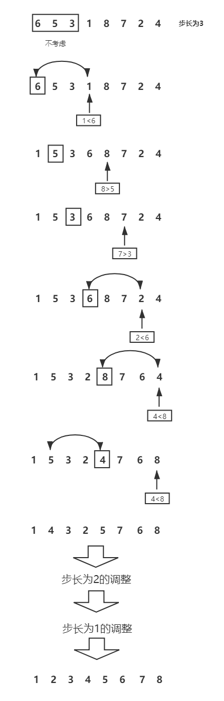

# 排序

### 1.经典排序算法介绍

#### （1）冒泡排序

时间复杂度：O(N^2)

#### （2）选择排序

时间复杂度：O(N^2)

从0~N-1中找出最小的数x1，将x1与数组中第一个数交换位置，接着在1~N-1中找出最小的数x2，将x2与数组中第二个数交换位置，以此类推，知道数组剩下一个数为止。

#### （3）插入排序

时间复杂度：O(N^2)

将位置K上的数x与K之前的所有数挨个进行比较大小，如果比x大则交换位置，直到找到一个小于x的数，停止交换。

#### （4）归并排序

时间复杂度：O(N*logN)

让数组中的每一个数成为长度为1的有序区间，接着两两合并相邻有序区间，得到最大长度为2的有序区间。以此进行下去，直到数组中的数成为统一的一个有序区间。


#### （5）快速排序

时间复杂度：O(N*logN)

1. 随机地在数组中选择一个数作为划分值x，小于等于x的数放在x的左边，大于等于x的数放在x的右边。
2. 对划分值x左右两个部分递归进行步骤1。


***划分过程**

1. 将划分值与数组中最后一个数交换位置
2. 在数组的左边设计一个小于等于区间，初始化长度为0。
3. 从左到右遍历整个数组元素。如果当前元素大于划分值，则继续遍历下一个元素。如果当前元素小于等于划分值，则把当前元素与小于等于区间的下一个值进行交换，随后小于等于区间向右扩大一个位置。
4. 当遍历到最后一个数时，将最后一个数与小于等于区间的下一个数交换位置，完成划分。


#### （6）堆排序

时间复杂度：O(N*logN)

***堆的基本定义**

1. 堆是一颗完全二叉树，即数的第一层至倒数第二层的节点都是满的，而最后一层的节点都集中在左侧。
2. 堆中每个结点的子树都是堆。
3. 在数组中，当父节点的下标为 n 时，左孩子的下标为 n * 2 + 1，右孩子的下标为 n * 2 + 2。
4. 在数组中，当孩子节点的下标为 n 时，其父节点的下标为： (n - 1) / 2。

将i结点以下的堆整理为最大堆，注意这一步实现的基础实际上是：假设结点i以下的子堆已经是一个最大堆。shiftDown函数实现的功能实际上是：找到结点i在包括结点i的堆中的正确位置。在做第一次堆化时，heapSort 中写了一个 for 循环，从第一个非叶子结点开始，对每一个非叶子结点都执行 shiftDown操作，所以就满足了每一次 shiftDown中，结点i以下的子堆已经是一最大堆。

```javascript
function maxHeap(arr){
    // 初始化大顶堆，从第一个非叶子结点开始
    for(let i = Math.floor(arr.length/2-1); i >= 0; i--){
        shiftDown(arr, i, arr.length);
    }
    // 排序，每一次for循环找出一个当前最大值，数组长度减一
    for(let i = arr.length-1; i>0; i--){
        [arr[0], arr[i]] = [arr[i], arr[0]];         // 根节点与最后一个节点交换
        shiftDown(arr, 0, i);                        // 从根节点开始调整，并且最后一个结点已经为当
    }                                                // 前最大值，不需要再参与比较，所以第三个参数
}                                                    // 为 i，即比较到最后一个结点前一个即可


function shiftDown(arr, i, length){
    let temp = arr[i];                                  // 当前父节点
                                                        // j<length 的目的是对结点 i 以下的结点全部做顺序调整
    for(let j = 2*i+1; j < length; j = 2*j+1){
        temp = arr[i];                                  // 将 A[i] 取出，整个过程相当于找到 A[i] 应处于的位置
        if(j+1 < length && arr[j] < arr[j+1]){
            j++;                                        // 找到两个孩子中较大的一个，再与父节点比较
        }
        if(temp < arr[j]){
            [arr[i], arr[j]] = [arr[j], arr[i]];        // 如果父节点小于子节点:交换；否则跳出
            i = j;                                      // 交换后，temp 的下标变为 j
        }else{
            break;
        }
    }
}
```

#### （7）希尔排序

时间复杂度：O(N*logN)

希尔排序是插入排序的改良算法，插入排序比较时步长为1，希尔排序的步长是随时调整的，但最后都会以步长为1的情况结束。



```javascript
function hillSort(arr, step){
    while(step > 0){
        for(let i = step; i < arr.length; i++){
            let temp = i;
            while(temp > 0){
                if(arr[temp] < arr[temp-step]){
                    [arr[temp], arr[temp-step]] = [arr[temp-step], arr[temp]];
                    temp -= step;
                }else{
                    break;
                }
            }
        }
        step--;  // 调整步长
    }
    return arr;
}
```

#### （8）计数排序

时间复杂度：O(N)

假设要把员工按身高排序，因为正常成年人的身高在100cm~300cm之间，所以设计300个桶，把员工按身高放入对应的桶中，当所有员工都放入桶中后，再依次倒出，就得到了排序后的员工顺序。


#### （9）基数排序

时间复杂度：O(N)

1. 将待排序的数字都变为相同位数，位数不够在数字前面加0。
2. 从0~9建立9个桶
3. 以三位数为例，首先每个数根据**个位**上的数进入相应的桶中，待所有数字都入桶后，依次倒出所有数；接着，根据**十位**上的数进入相应的桶中，待所有数字都入桶后，依次倒出所有数；最后，根据**百位**上的数进入相应的桶中，待所有数字都入桶后，依次倒出所有数。
4. 结束以上操作，得到排序好的数组。


### 2.经典排序的空间复杂度

- O(1)：插入排序、选择排序、冒泡排序、堆排序、希尔排序
- O(logN)~O(N)：快速排序
- O(N)：归并排序
- O(M)：计数排序、基数排序（M与桶的数量有关）

### 3.经典排序算法的稳定性

稳定性的概念：假定待排序的记录序列中，存在多个具有相同的关键字的记录，若经过排序，这些记录的相对次序保持不变，称这种排序算法是稳定的，否则称为不稳定的。**简单来说就是排序操作改变了原数组中数字的相对位置。**

稳定的排序算法：

冒泡排序、插入排序、归并排序、计数排序、基数排序、桶排序

不稳定的排序算法：

选择排序、快速排序、希尔排序、堆排序

#### （1）选择排序不稳定举例


#### （2）堆排序不稳定举例


#### （3）快速排序不稳定举例


#### (4)希尔排序不稳定举例


### 3.补充说明

#### （1）排序算法无绝对优劣

通常不能随便说哪种排序算法好。这个和要排序的元素相关。例如对人的年龄排序或者身高排序,因为这种数据范围通常比较小,可以考虑采用计数排序。但是对于均匀分布的整数,计数排序就不合适了。除非面试题特别说明,否则认为要排序的数据范围是均匀分布的。

#### （2）快速排序为什么叫快速排序

快速排序之所以叫快速排序,并不代表它比堆排序和归并排序优良。在最好情况下,它的渐进复杂度与堆排序和归并排序是相同的。只是快速排序的常量系数比较小而已。

#### （3）工程上提供的排序

1. 工程上的排序是综合排序
2. 数组较小时,插入排序
3. 数组较大时,快速排序或其它O(N*logN)的排序

### 4.高频题

#### （1）例题一

**题目**：已知一个几乎有序的数组,几乎有序是指,如果把数组排好顺序的话,每个元素移动的距离不超过k,并且k相对于数组长度来说很小。请问选择什么方法对其排序比较好？

**分析**：

首先考虑时间复杂度为O(N)的算法，如计数排序、基数排序。这两种排序都是不基于比较的排序算法，因此具有不适用所有情况的限制，在本例中不知道数组的规模和范围，因而不适用。

接着考虑时间复杂度为O(N^2)的排序算法，因为冒泡排序和选择排序与数组原始序列无关，因而排除。插入排序的过程与原始序列的顺序有关，每个元素向前插入的区间是有限的，可以满足题中移动距离不超过k的条件，对于本题，使用插入排序的时间复杂度小于等于O(N*K)。

最后考虑时间复杂度为O(NlogN)的排序算法，快速排序、归并排序与数组原始顺序无关可以排除。

本题的正确答案是改进后的堆排序算法。

已知，每个元素移动的距离不超过k，因此数组的最小值是包含在0~k-1的范围内，因此步骤如下。

1. 首先给位置0~k-1上的数建立小根堆，小根堆的堆顶肯定是整个数组的最小值，最小值弹出堆顶，放在数组的位置0处。
2. 将位置k上的数插入堆顶，进行小根堆调整，弹出堆顶元素，放在数组的位置1处。
3. 直到所有数都从堆中弹出，则完成排序


时间复杂度分析：每一次小根堆调整的时间复杂对为O(logK)，总共N个数，因此时间复杂度为O(N*logK)。

#### （2）例题二

**题目**：判断数组中是否有重复值，必须保证额外空间复杂度为O(1)。

**分析**：

如果没有空间复杂度的要求，用哈希表实现。时间复杂度为O(N)，空间复杂度为O(N)。

加上空间复杂度的限制后，应该先排序后判断，这使题目就变成了考察经典排序算法的空间复杂度。我们很容易想到使用堆排序和希尔排序，因为堆排序经典实现才用了递归的方法，堆排序的空间复杂度为O(logN)，所以要改成非递归实现的堆排序。

#### （3）例题三

**题目**：把两个有序数组合并为一个数组。第一个数组孔家正好可以容纳两个数组的元素。

**分析**：从后往前比较数字大小，并且覆盖


#### （4）例题四

**题目**：荷兰国旗问题。只包含0,1,2的整数数组进行排序，要求只使用交换、原地排序，而不是利用计数进行排序。

**分析**：

本题主要过程与快排划分过程类似，可以做到时间复杂度O(N)，额外空间复杂度O(1)。

1. 在遍历数组之前在数组的左侧设立一个0区，初始化长度为0。在数组右侧设立一个2区，初始化长度也为0。
2. 从左到右遍历数组，如果当前数为1则跳到下一个数；如果当前数为0，则和0区的下一个数交换位置，0区向右扩一个位置；如果当前数为2，则和2区的前一个数交换位置，并判断交换位置后当前位置上的数。
3. 当遍历到与2区重合的位置处时，结束遍历。

#### （5）例题五

**题目**：在行列都排好序的矩阵中找数

```
0    1    2    5
2    3    4    7
4    4    4    8
5    7    7    9
```

如果k为7，返回true；如果k为6，返回false。

**分析**：

1. 从二维数组的右上角开始找数，如果当前数大于要找的数，则在数组中向下移一位，如果当前数小于要找的数，则在数组中向左移一位。
2. 若找到相同的数则返回true，若遍历到越界都没有找到，则返回false。

时间复杂度：O(M+N)

额外空间复杂度：O(1)

#### （6）例题六

**题目**：找出数组中需要排序的最短子数组长度，如[1, 5, 4, 3, 2, 6, 7]，返回4，因为只有[5, 4, 3, 2]需要排序。

**分析**：

1. 从左到右遍历整个数组，单独用一个变量MAX记录遍历过的最大值，关注MAX大于当前数的情况，记录发生这种情况最右的位置。
2. 从右到左遍历整个数组，单独用一个变量MIN记录遍历过的最小值，关注MIN小于当前数的情况，记录发生这种情况最左的位置。
3. 题目的结果等于最右位置-最左位置+1

最优解时间复杂度O(N)，额外空间复杂度O(1)