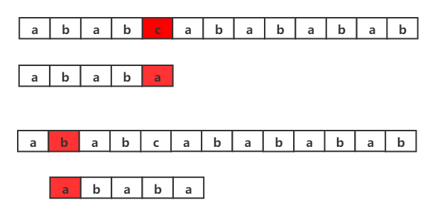

# 字符串

### 1.字符串题目特点梳理

#### （1）字符串面试题的特点

1. 广泛性：字符串可以看做字符类型的数组，与数组排序、查找、调整有关；很多其他类型的面试题可以看做字符串类型的面试题。
2. 需掌握的概念：回文；子串（连续）；子序列（不连续）；前缀树（Trie树）；后缀树和后缀数组；匹配；字典序。
3. 需掌握的操作：与数组有关的操作：增删改查；字符的替换；字符串的旋转。

#### （2）字符串题目的常见类型

1. 规则判断：判断字符串是否符合整数规则；判断字符串是否符合浮点数规则；判断字符串是否符合回文字符串规则；等等······
2. 数字运算：基本类型表达整数范围有限，所以经常用字符串实现大整数，与大整数相关的加减乘除操作，需要模拟笔算过程。
3. 与数组操作有关的类型：数组有关的调整、排序等操作需要掌握；快速排序的划分过程需要掌握和改写。
4. 字符计数：哈希表；滑动窗口问题、寻找无重复字符子串问题、计算变位词问题。
5. 动态规划类型：最长公共子串问题；最长公共子序列问题；最长回文子串；最长回文子序列······
6. 搜索类型：宽度优先搜索；广度优先搜索
7. 高级算法与数据结构解决问题：Manacher算法解决最长回文子串问题；KMP算法解决字符串匹配问题；前缀树结构；后缀树和后缀数组


### 2.高频题

#### （1）例题一

**题目**：给定彼此独立的两颗树头结点分别为t1和t2，判断t1中是否有与t2树拓扑结构完全相同的子树。

例如，下图所示的t1树和t2树：


t1树有与t2树拓结构完全相同的子树，所以返回true。

但如果t1树和t2树如下图所示：


t1树没有与t2树拓扑结构完全相同的子树，所以返回false。

**分析**：

1. **普通解法**为二叉树遍历+匹配问题，考察t1中以每个节点为头的子树是否与t2一致。时间复杂度为O(N*M)，N代表t1节点数，M表示t2节点数。
2. **最优解法**为二叉树序列化+KMP算法，时间复杂度为O(M+N)


**KMP算法介绍**：

KMP算法是一种改进的**字符串匹配算法**，由D.E.Knuth，J.H.Morris和V.R.Pratt提出的，因此人们称它为克努特—莫里斯—普拉特操作（简称KMP算法）。KMP算法的核心是利用匹配失败后的信息，尽量减少模式串与主串的匹配次数以达到快速匹配的目的。具体实现就是通过一个next数组实现，数组包含了模式串的局部匹配信息。KMP算法的时间复杂度O(m+n)。

现有两个字符串，其中

主串（T）：a b a c a a b a c a b a c a b a a b b

模式串（S）：a b a c a b

（a）暴力算法

所谓暴力算法，即从原字符串开始搜索，若出现不能匹配，则主串从原搜索位置+1继续，而模式串则从头开始搜索。



虽然前4位一样但是第5位不一样，需要从原来的位置+1,再进行匹配。以此类推，直到匹配为止。

（b） KMP匹配

真前缀：除了自身以外，一个字符串的全部头部组合。

真后缀：除了自身以外，一个字符串的全部尾部组合。


假设现在文本串S匹配到 i 位置，模式串P匹配到 j 位置

- 如果j = -1，或者当前字符匹配成功（即S[i] == P[j]），都令i++，j++，继续匹配下一个字符；
- 如果j != -1，且当前字符匹配失败（即S[i] != P[j]），则令 i 不变，**j = next[j]**。此举意味着失配时，模式串P相对于文本串S向右移动了j - next [j] 位。换言之，当匹配失败时，模式串向右移动的位数为：失配字符所在位置 - 失配字符对应的next 值，即移动的实际位数为：j - next[j]，且此值大于等于1。

next 数组各值的含义：代表当前字符之前的字符串中，有多大长度的相同前缀后缀。

如下图所示，当匹配到第5个位置时发现主串与模式串不一样，此时，若是在暴力法中主串要回到第2个位置，模式串要回到第1个位置，如此一来增加了大量的时间复杂度。

在比到第5个位置时，我们知道主串的前4个位置与模式串前4个位置是完全对应的，那么我们可以利用这个信息优化位置移动。

前4个字符“abab”的真前缀为"a"、"ab"、"aba"，真后缀为"bab"、"ab"、"b"。真前缀和真后缀的交集为"ab"，如下图所示，主串不用变，只需模式串移动到第3个位置，此时主串的第2、3位置与模式串的第1、2位置对应，从第3个位置开始继续对比。


那么如何去找到模式串移动的长度，也就是next数组的值。我们可以先求出模式串前缀后缀的最大公共元素长度，如下表所示。

| 模式串                   | a    | b    | a    | b    | a    |
| ------------------------ | ---- | ---- | ---- | ---- | ---- |
| 下标                     | 0    | 1    | 2    | 3    | 4    |
| 前后缀的最大公共元素长度 | 0    | 0    | 1    | 2    | 3    |

根据这个表可以得出下面的结论，失配时，模式串向右移动的位数为：当前匹配字符下标 - 当前字符的上一位字符所对应的最大长度值。如此，便引出了next 数组，给定字符串“ababa”，可求得它的next 数组如下：

| 模式串                   | a    | b    | a    | b    | a    |
| ------------------------ | ---- | ---- | ---- | ---- | ---- |
| 下标                     | 0    | 1    | 2    | 3    | 4    |
| 前后缀的最大公共元素长度 | 0    | 0    | 1    | 2    | 3    |
| next数组                 | -1   | 0    | 0    | 1    | 2    |

next 数组相当于“前后缀的最大公共元素长度” 整体向右移动一位，然后初始值赋为-1。有了这个next 数组，在KMP匹配中，当模式串中j 处的字符失配时，下一步用next[j]处的字符继续跟文本串匹配，相当于模式串向右移动j - next[j] 位。

next数组可以用递推的方式算出，k为主串位置，j为模式串位置

- 若p[k] == p[j]，则next[j + 1 ] = next [j] + 1 = k + 1；
- 若p[k ] ≠ p[j]，如果此时p[ next[k] ] == p[j ]，则next[ j + 1 ] = next[k] + 1，否则继续递归前缀索引k = next[k]，而后重复此过程。

```javascript
var strStr = function(haystack, needle) {
    if(needle.length === 0){
        return 0;
    }
    var next = [-1],
        j = 0,
        k = -1;
    while(j < needle.length-1){
        if(k == -1 || needle[j] == needle[k]){
            j++;
            k++;
            if(needle[j] != needle[k]){
                next[j] = k;
            }else{
                next[j] = next[k];
            }
        }else{
            k = next[k];
        }
    }

    var m = 0,
        n = 0;
    while(m < haystack.length && n < needle.length){
        if(n == -1 || haystack[m] === needle[n]){
            m++;
            n++;
        }else{
            n = next[n];
        }
    }

    return n === needle.length;
};
```

#### （2）例题二

**题目**：给定两个字符串str1和str2，如果str1和str2中出现的字符种类一样且每种字符出现的次数也一样，那么str1与str2互为变形词，请实现函数判断两个字符串是否互为变形词。

举例：

str1="123"，str2="231"。返回true。

str1="123"，str2="2331"。返回false。

**分析**：用哈希表做字符统计


#### （3）例题三

**题目**：如果一个字符串str，把字符串str前面任意的部分挪到后面去形成的字符串叫做str的旋转词。比如str="1234"，str的旋转词有"1234"、"2341"、"3412"、"4123"。给定两个字符串a和b，请判断a和b是否互为旋转词。

举例：

a="cdab"，b="abcd"。返回true。

a="1ab2"，b="ab12"。返回false。

a="2ab1"，b="ab12"。返回true。

**分析**：

最优解时间复杂度为O(N)

1. 判断str1与str2是否长度相等
2. 如果长度相等，生成str1+str1的大字符串
3. 用KMP算法判断大字符串中是否含有str2

注：如果str1长度为N，在str1+str1的字符串中，任意一个长度为N的子串都是str1的旋转词。

#### （4）例题四

**题目**：给定一个字符串str，请在单词间做逆序调整。

举例：

"pig loves dog"逆序成"dog loves pig"。

"I'm a student."逆序成"student. a I'm "

**分析**：

1. 实现将字符串局部所有字符串逆序的函数f。
2. 利用f将字符串所有字符逆序。"pig loves dog" ——>"god sevol gip"
3. 找到逆序后的字符串中每一个单词的区域，利用f将每一个单词的区域逆序。"god sevol gip" ——> "dog loves pig"

#### （5）例题五

**题目**：给定一个字符串str，和一个整数i。i代表str中的位置，将str[0...i]移到右侧，str[i+1...N-1]移到左侧。

举例：

str="ABCDE"，i=2。将str调整为"DEABC"。要求时间复杂度为O(N)，额外空间复杂度为O(1)。

**分析**：额外空间复杂度为O(1)，所以不能使用额外数组保存字符。


#### （6）例题六

**题目**：给定一个字符串类型的数组strs，请找到一种拼接顺序，使得将所有字符串拼接起来组成的大字符串是所有可能性中字典顺序最小的，并返回这个大字符串。
举例：
strs=["abc", "de"]。可以拼成" abcde”，也可以拼成"deabc"，但前者字典顺序更小，所以返回"abcde"。
strs=["b", "ba"]可以拼成“bba"，也可以拼成"bab，但后者字典顺序更小，所以返回"bab"。

**分析**：

方案一：根据单独每个字符串的字典顺序排序


但是，方案一是错误的，比如：


拼接后为"bba"

但是"bab"的字典序更小，所以方案一错误。

方案二：如果str1+str2<str2+str1，则str1放在前面，否则，str2放在前面。

#### （7）例题七

**题目**：给定一个字符串str，将其中所有空格字符替换成"%20"，假设str后面有足够的空间。

**分析**：

原字符串长度为L，遍历str，发现空格数量为N，所以替换后的字符串长度为L+2\*N。从原字符串的最后一个字符开始，如果是空格则从第L+2\*N-1处以此向前添加"0", "2"和"%"，然后继续判断原字符串的下一个字符。如果不是空格，则把该字符复制到L+2\*N-1的位置处，然后继续向前判断。

#### （8）例题八

**题目**：给定一个字符串str，判断是不是整体有效括号字符串。

举例：

str = "()"，返回true。str = "(()())"，返回true。str = "(())"，返回true。

str = "())"，返回false。str = "()("，返回false。str = "())()"，返回false。

**分析**：

1. 定义一个变量num，记录 '(' 出现次数与 ')' 出现次数的差值。
2. 遍历的过程中遇到 '(' 则num++。
3. 遍历的过程中遇到 ')' 则num--。
4. 遍历的过程中如果num<0，则直接返回false。
5. 如果一直没有出现情况4，则一直遍历下去。
6. 遍历完成后，如果num==0，则返回true，否则返回false。

#### （9）例题九

**题目**：给定一个字符串str，返回str的最长无重复字符串子串的长度。

举例：

str="abcd"，返回4。

str="abcb"，最长无重复字符子串为"abc"，返回3。

**分析**：

最优解时间复杂度为O(N)，额外空间复杂度为O(N)。

求出以str中每个字符结尾的情况下，最长无重复字符串子串的长度，并在其中找出最大值返回。

1. 首先根据哈希表map查出当前位置i处的字符上次出现的位置，令其后一个的位置为A，那么最长无重复子串最多也不会超过位置A。
2. 变量pre代表以i-1位置处字符结尾的最长无重复子串的起始位置，令其为B。那么，对于位置i处的字符，要想得到最长无重复子串，就不能超过位置B，因为一旦超过位置B，就有可能发生位置i之前的字符出现重复。
3. 总而言之，位置A和位置B谁更靠右，谁就是以位置i处字符结尾的最长无重复子串。
4. 比较位置i处最长无重复子串长度与当前最长无重复子串长度，取二者中最长的。更新哈希表和遍历pre，继续向后遍历

